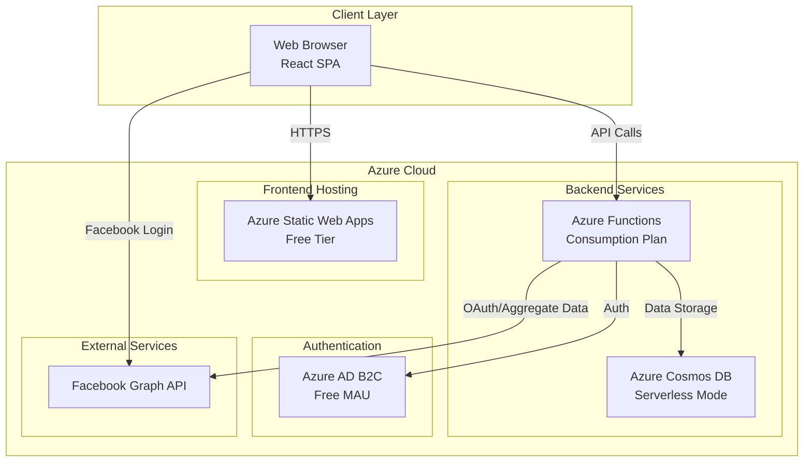
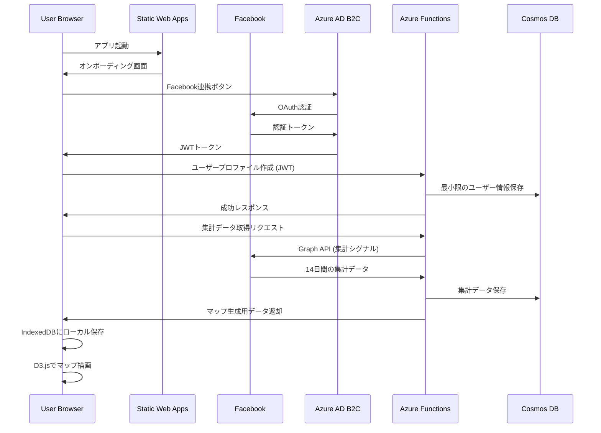
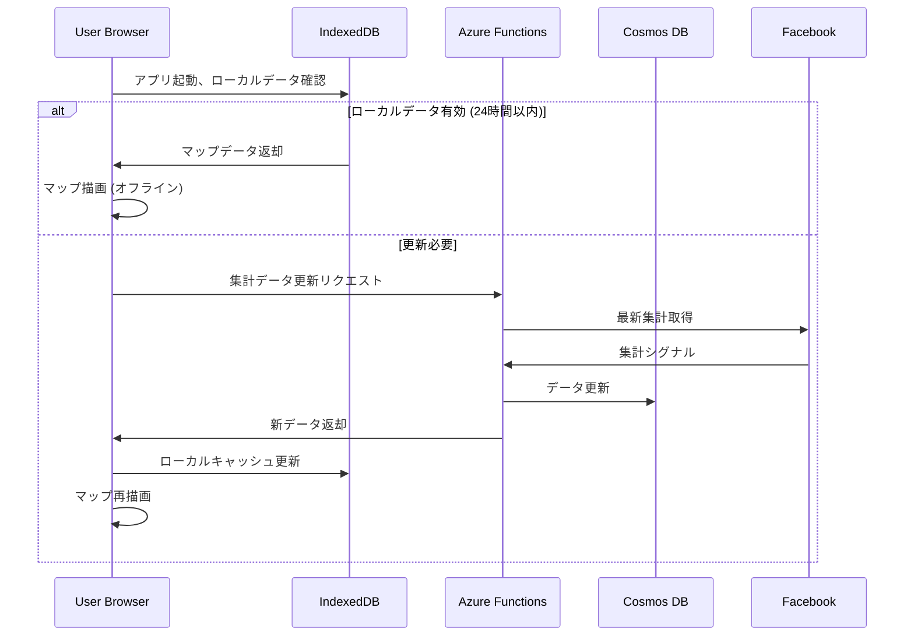

# アプリケーション設計書: 心の距離マップ

## 1. 概要

「心の距離マップ」は、ユーザーの人間関係を視覚的に「距離」として表現するWebアプリケーションです。Facebookの集計データ（個人の投稿内容やメッセージではなく）を利用し、直感的なマップUIでユーザーに提示します。

### 1.1 アプリケーション仕様
- **アプリ名**: 心の距離マップ
- **コードネーム**: koro-map-fb-l2
- **プラットフォーム**: Web、モバイルWeb
- **主言語**: 日本語 (ja-JP)
- **デプロイ先**: Microsoft Azure

## 2. システムアーキテクチャ

### 2.1 アーキテクチャ原則

1. **コスト最適化優先**: サーバーレス・従量課金を基本とし、固定費を最小化
2. **シンプル設計**: 過度な複雑性を避け、保守性を重視
3. **プライバシー第一**: ユーザーデータはローカル優先、サーバー保存最小化
4. **スケーラビリティ**: 初期は小規模、需要に応じて自動スケール

### 2.2 システム構成図



## 3. テクノロジースタック

### 3.1 フロントエンド

| 要素 | 選択技術 | 理由 |
|------|---------|------|
| フレームワーク | **React** | 軽量、エコシステム充実、学習コスト低 |
| ビルドツール | **Vite** | 高速、シンプル設定 |
| UI/スタイリング | **Vanilla CSS + CSS Modules** | 軽量、オーバーヘッド無し |
| 可視化ライブラリ | **D3.js** | マップ表示に最適、カスタマイズ性高 |
| 状態管理 | **React Context / useState** | 過度な複雑性回避（Reduxは不要） |
| ローカルストレージ | **IndexedDB (via Dexie.js)** | 構造化データ保存に適切 |
| 言語 | **TypeScript** | 型安全性によるバグ削減 |

### 3.2 バックエンド

| 要素 | 選択技術 | 理由 |
|------|---------|------|
| API | **Azure Functions (Node.js)** | サーバーレス、従量課金、運用コスト最小 |
| ランタイム | **Node.js 20 LTS** | 最新安定版 |
| 言語 | **TypeScript** | フロント・バックで統一 |
| 認証 | **Azure AD B2C** | 月間50,000 MAU無料、Facebook統合 |
| データベース | **Azure Cosmos DB (Serverless)** | 低トラフィック時のコスト最適、グローバル分散可能 |
| ロギング | **Azure Application Insights** | プランに含まれる監視 |

### 3.3 デプロイ・運用

| 要素 | 選択技術 | 理由 |
|------|---------|------|
| フロントエンドホスティング | **Azure Static Web Apps (Free)** | 無料枠で十分、CDN込、Github連携 |
| CI/CD | **GitHub Actions** | 無料、Static Web Appsと統合 |
| 環境管理 | **dotenv / Azure Key Vault** | 機密情報の安全管理 |
| モニタリング | **Azure Monitor** | 基本監視無料 |

## 4. Azure サービス詳細と コスト見積もり

### 4.1 Azure Static Web Apps (Free Tier)

**選定理由**:
- 完全無料プランで100GB/月の帯域幅
- 自動SSL、CDN、カスタムドメイン対応
- GitHub連携でCI/CD自動化

**制限**:
- 0.5GB ストレージ (SPA配信には十分)
- 2つのカスタムドメイン

**月額コスト**: **¥0**

---

### 4.2 Azure Functions (Consumption Plan)

**選定理由**:
- 実行分だけ課金（アイドル時¥0）
- 月間100万実行 + 40万GB秒 無料
- HTTP トリガーでREST API実装

**想定利用**:
- Facebook集計データ取得: 1日1回/ユーザー
- マップ生成ロジック: ユーザー起動時
- 月間想定: ~10万実行 (1000ユーザー × 100回/月)

**月額コスト**: **¥0 (無料枠内)**

---

### 4.3 Azure Cosmos DB (Serverless)

**選定理由**:
- 低トラフィック時に最もコスト効率が良い
- スケーラビリティ (将来の成長に対応)
- JSONドキュメント保存に最適

**データ設計**:
- ユーザープロファイル (最小限)
- Facebook集計シグナル (14日間分)
- ローカルデータのバックアップ (任意)

**想定利用** (1000ユーザー):
- ストレージ: ~10GB
- RU消費: 月間 ~100万 RU

**月額コスト**: 約 **¥1,500〜3,000**
- ストレージ: ¥30/GB
- RU: ¥0.3/100万 RU

> **コスト削減オプション**: 
> - MVP段階では **Azure Table Storage** (¥1/GB/月) に変更可能 → 月額 **¥10〜50**
> - データ保持期間を7日に短縮

---

### 4.4 Azure AD B2C

**選定理由**:
- Facebook認証の統合が容易
- 月間50,000 MAU まで無料
- エンタープライズグレードのセキュリティ

**月額コスト**: **¥0 (無料枠内)**

---

### 4.5 総コスト見積もり

| シナリオ | 月額コスト (概算) |
|---------|----------------|
| **MVP (Table Storage使用)** | **¥0〜100** |
| **運用開始 (1000ユーザー)** | **¥1,500〜3,000** |
| **成長期 (10,000ユーザー)** | **¥10,000〜20,000** |

> **注**: Cosmos DB Serverlessは使用量に応じた従量課金のため、実際のコストはユーザー行動に依存

## 5. データフロー

### 5.1 初回ユーザー登録フロー



### 5.2 通常利用フロー



## 6. プライバシー・セキュリティ設計

### 6.1 データ取り扱い原則

| データ種別 | 取得 | 保存場所 | 保持期間 |
|-----------|-----|---------|---------|
| 投稿本文・画像 | ❌ 取得しない | - | - |
| DM/メッセージ | ❌ 取得しない | - | - |
| 友達リスト (個人名) | ❌ 取得しない | - | - |
| **集計シグナル** (リアクション総量等) | ✅ 取得 | ローカル優先 / サーバーバックアップ | 14日間 |
| ユーザー入力ラベル | ✅ 取得 | ローカルのみ | ユーザー削除まで |
| ユーザーID (最小限) | ✅ 取得 | Cosmos DB | ユーザー削除まで |

### 6.2 Facebook Graph API スコープ

要求する最小限のスコープ (最終的にAPI仕様確認が必要):

- `public_profile`: 基本プロファイル
- `email`: オプション (連絡用)
- ~~`user_friends`~~: **不使用** (個人名取得のため)
- カスタム集計エンドポイント (要調査)

> **重要**: Facebook Graph API v19.0時点で、個人を特定しない集計データ取得の可否を要確認。API仕様によっては代替アプローチ（ユーザー自己入力ベース）に変更。

### 6.3 セキュリティ対策

1. **認証・認可**
   - すべてのAPI呼び出しにJWT検証
   - CORS設定でSWAドメインのみ許可

2. **データ暗号化**
   - 通信: TLS 1.2以上 (Azure標準)
   - 保存: Cosmos DB暗号化 (Azure標準)

3. **プライバシー保護**
   - ユーザー名の自動取得禁止
   - データ削除APIの実装
   - 設定画面から連携解除可能

## 7. アプリケーション構造

### 7.1 ディレクトリ構成

```
congenial-lamp/
├── docs/                    # 設計ドキュメント
│   ├── requirements.json
│   ├── architecture-design.md (本ドキュメント)
│   └── api-specification.md
├── frontend/                # React SPA
│   ├── src/
│   │   ├── components/      # Reactコンポーネント
│   │   │   ├── Map/         # マップ表示
│   │   │   ├── Onboarding/  # 初回説明
│   │   │   └── Settings/    # 設定画面
│   │   ├── services/        # API通信・データ管理
│   │   ├── hooks/           # カスタムフック
│   │   ├── utils/           # ユーティリティ
│   │   └── types/           # TypeScript型定義
│   ├── public/
│   ├── package.json
│   └── vite.config.ts
├── backend/                 # Azure Functions
│   ├── src/
│   │   ├── functions/       # 関数定義
│   │   │   ├── auth/        # 認証関連
│   │   │   ├── map/         # マップ生成
│   │   │   └── facebook/    # Facebook連携
│   │   ├── services/        # ビジネスロジック
│   │   ├── models/          # データモデル
│   │   └── utils/
│   ├── host.json
│   └── package.json
├── infrastructure/          # IaC (Bicep)
│   ├── main.bicep           # メインテンプレート
│   └── parameters.json
└── .github/
    └── workflows/           # CI/CD
        ├── frontend-deploy.yml
        └── backend-deploy.yml
```

## 8. MVP実装スコープ

### 8.1 Phase 1: 基盤構築
- [x] Azure環境セットアップ (Static Web Apps, Functions, Cosmos DB)
- [x] React + Vite プロジェクト初期化
- [x] Azure Functions プロジェクト初期化
- [x] CI/CD パイプライン構築 (GitHub Actions)

### 8.2 Phase 2: 認証・データ取得
- [ ] Azure AD B2C セットアップ
- [ ] Facebook OAuth統合
- [ ] 集計データ取得ロジック (Functions)
- [ ] ローカルストレージ実装 (IndexedDB)

### 8.3 Phase 3: コアUI
- [ ] オンボーディング画面
- [ ] マップ表示 (D3.js)
- [ ] ノード配置アルゴリズム (距離・色)
- [ ] タップで詳細カード表示

### 8.4 Phase 4: MVP完成
- [ ] 観測文生成ロジック
- [ ] ラベル編集機能
- [ ] 設定画面 (連携解除・データ削除)
- [ ] スクショ共有対応UI

## 9. 非機能要件

### 9.1 パフォーマンス
- 初回起動 → マップ表示: **5秒以内**
- ローカルキャッシュ利用時: **1秒以内**
- Functions Cold Start: 3秒以内 (Consumption Plan標準)

### 9.2 可用性
- Static Web Apps: 99.95% SLA
- Functions: 99.95% SLA
- Cosmos DB: 99.99% SLA (単一リージョン)

### 9.3 スケーラビリティ
- 初期目標: 1,000 アクティブユーザー
- スケール上限: 100,000 ユーザー (Azureサービスの自動スケールで対応)

## 10. リスクと軽減策

### 10.1 技術的リスク

| リスク | 影響 | 軽減策 |
|-------|-----|-------|
| Facebook API仕様変更で集計データ取得不可 | 高 | フォールバック: ユーザー手動入力モード実装 |
| Cosmos DB コスト増大 | 中 | MVP時はTable Storage使用、監視アラート設定 |
| Cold Start遅延 | 低 | Premium Plan移行 (有料時) |

### 10.2 ビジネスリスク

| リスク | 影響 | 軽減策 |
|-------|-----|-------|
| 監視アプリと誤解される | 高 | UI/UXで明確にプライバシー方針提示 |
| ユーザー獲得困難 | 中 | スクショ共有機能で口コミ促進 |

## 11. 次のステップ

1. **API仕様書の作成** (`docs/api-specification.md`)
2. **インフラ構築スクリプト作成** (Bicep)
3. **実装計画書の作成** (`implementation_plan.md`)
4. **ユーザーレビュー**

---

**作成日**: 2026-01-31  
**作成者**: Antigravity AI  
**バージョン**: 1.0
