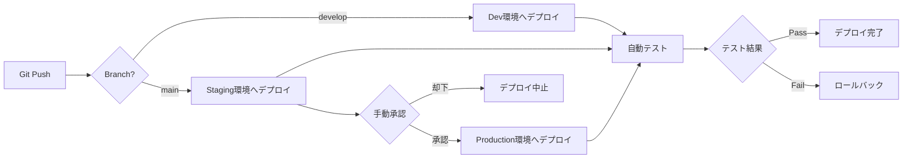
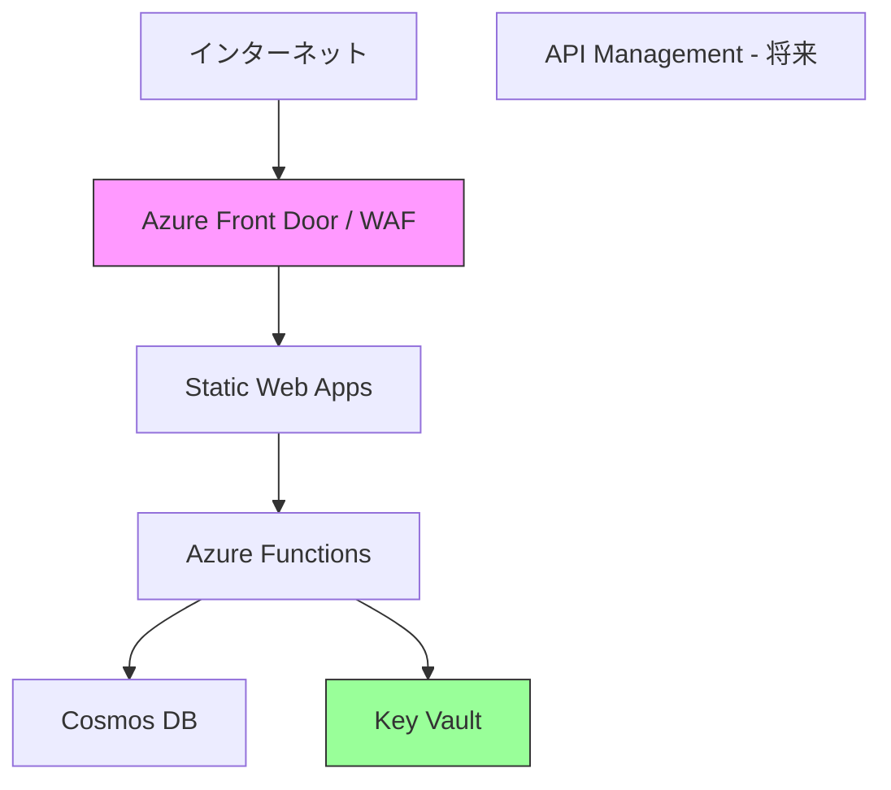

# デプロイメント設計書: 心の距離マップ

## 1. 概要

本ドキュメントはAzure環境へのデプロイメント構成とCI/CDパイプラインを定義します。

## 2. Azure環境構成

### 2.1 リソースグループ構成

```
リソースグループ名: rg-koro-map-{env}
リージョン: Japan East
環境: dev, staging, production
```

### 2.2 Azure リソース一覧

| リソース名 | Azure サービス | SKU/プラン | 用途 |
|----------|--------------|-----------|------|
| `swa-koro-map-{env}` | Static Web Apps | Free | フロントエンドホスティング |
| `func-koro-map-{env}` | Functions | Consumption | バックエンドAPI |
| `cosmos-koro-map-{env}` | Cosmos DB | Serverless | データストア |
| `b2c-koro-map` | AD B2C | Free (50K MAU) | 認証 |
| `appi-koro-map-{env}` | Application Insights | Pay-as-you-go | 監視 |
| `kv-koro-map-{env}` | Key Vault | Standard | シークレット管理 |

### 2.3 環境別設定

| 項目 | Development | Staging | Production |
|-----|------------|---------|-----------|
| リージョン | Japan East | Japan East | Japan East |
| Cosmos DB RU | 最小 | 最小 | 自動スケール |
| Functions タイムアウト | 30秒 | 60秒 | 60秒 |
| ログレベル | Debug | Info | Warning |
| データ保持期間 | 7日 | 14日 | 30日 |

## 3. Infrastructure as Code (IaC)

### 3.1 Azure Bicep テンプレート構造

```
infrastructure/
├── main.bicep                 # メインエントリポイント
├── modules/
│   ├── static-web-app.bicep   # Static Web Apps
│   ├── function-app.bicep     # Azure Functions
│   ├── cosmos-db.bicep        # Cosmos DB
│   ├── app-insights.bicep     # Application Insights
│   └── key-vault.bicep        # Key Vault
├── parameters/
│   ├── dev.parameters.json
│   ├── staging.parameters.json
│   └── prod.parameters.json
└── README.md
```

### 3.2 デプロイコマンド

```bash
# リソースグループ作成
az group create \
  --name rg-koro-map-dev \
  --location japaneast

# Bicepデプロイ
az deployment group create \
  --resource-group rg-koro-map-dev \
  --template-file infrastructure/main.bicep \
  --parameters @infrastructure/parameters/dev.parameters.json
```

## 4. CI/CDパイプライン

### 4.1 GitHub Actionsワークフロー

#### フロントエンド: `.github/workflows/frontend-deploy.yml`

```yaml
name: Deploy Frontend

on:
  push:
    branches:
      - main
      - develop
    paths:
      - 'frontend/**'
  pull_request:
    types: [opened, synchronize, reopened]
    paths:
      - 'frontend/**'

jobs:
  build-and-deploy:
    runs-on: ubuntu-latest
    steps:
      - uses: actions/checkout@v4
        with:
          submodules: true

      - name: Setup Node.js
        uses: actions/setup-node@v4
        with:
          node-version: '20'
          cache: 'npm'
          cache-dependency-path: frontend/package-lock.json

      - name: Install dependencies
        run: cd frontend && npm ci

      - name: Run tests
        run: cd frontend && npm test

      - name: Build
        run: cd frontend && npm run build
        env:
          VITE_API_BASE_URL: ${{ secrets.API_BASE_URL }}
          VITE_B2C_TENANT: ${{ secrets.B2C_TENANT }}
          VITE_B2C_CLIENT_ID: ${{ secrets.B2C_CLIENT_ID }}

      - name: Deploy to Azure Static Web Apps
        uses: Azure/static-web-apps-deploy@v1
        with:
          azure_static_web_apps_api_token: ${{ secrets.AZURE_STATIC_WEB_APPS_API_TOKEN }}
          repo_token: ${{ secrets.GITHUB_TOKEN }}
          action: "upload"
          app_location: "frontend"
          output_location: "dist"
```

#### バックエンド: `.github/workflows/backend-deploy.yml`

```yaml
name: Deploy Backend

on:
  push:
    branches:
      - main
      - develop
    paths:
      - 'backend/**'
  pull_request:
    types: [opened, synchronize, reopened]
    paths:
      - 'backend/**'

jobs:
  build-and-deploy:
    runs-on: ubuntu-latest
    steps:
      - uses: actions/checkout@v4

      - name: Setup Node.js
        uses: actions/setup-node@v4
        with:
          node-version: '20'
          cache: 'npm'
          cache-dependency-path: backend/package-lock.json

      - name: Install dependencies
        run: cd backend && npm ci

      - name: Run tests
        run: cd backend && npm test

      - name: Build
        run: cd backend && npm run build

      - name: Deploy to Azure Functions
        uses: Azure/functions-action@v1
        with:
          app-name: func-koro-map-dev
          package: backend
          publish-profile: ${{ secrets.AZURE_FUNCTIONAPP_PUBLISH_PROFILE }}
```

### 4.2 デプロイフロー



### 4.3 ブランチ戦略

| ブランチ | 用途 | デプロイ先 | 保護設定 |
|---------|-----|-----------|---------|
| `main` | 本番リリース | Production (手動承認後) | ✅ レビュー必須 |
| `develop` | 開発統合 | Development | ✅ レビュー必須 |
| `feature/*` | 機能開発 | なし | - |
| `hotfix/*` | 緊急修正 | Staging → Production | ✅ レビュー必須 |

## 5. 環境変数とシークレット管理

### 5.1 GitHub Secrets

| シークレット名 | 説明 |
|-------------|-----|
| `AZURE_STATIC_WEB_APPS_API_TOKEN` | Static Web Appsデプロイトークン |
| `AZURE_FUNCTIONAPP_PUBLISH_PROFILE` | Functionsデプロイプロファイル |
| `API_BASE_URL` | バックエンドAPIのURL |
| `B2C_TENANT` | Azure AD B2Cテナント名 |
| `B2C_CLIENT_ID` | B2CクライアントアプリケーションID |

### 5.2 Azure Key Vault (ランタイム)

| シークレット名 | 説明 |
|-------------|-----|
| `CosmosDbConnectionString` | Cosmos DB接続文字列 |
| `FacebookAppSecret` | Facebook App Secret |
| `JwtSigningKey` | JWT署名キー (予備) |

### 5.3 環境変数設定 (Functions)

```json
{
  "COSMOS_DB_ENDPOINT": "@Microsoft.KeyVault(SecretUri=https://kv-koro-map.vault.azure.net/secrets/CosmosDbEndpoint/)",
  "COSMOS_DB_KEY": "@Microsoft.KeyVault(SecretUri=https://kv-koro-map.vault.azure.net/secrets/CosmosDbKey/)",
  "FACEBOOK_APP_ID": "123456789",
  "FACEBOOK_APP_SECRET": "@Microsoft.KeyVault(SecretUri=https://kv-koro-map.vault.azure.net/secrets/FacebookAppSecret/)",
  "B2C_TENANT": "koromap.onmicrosoft.com",
  "B2C_POLICY": "B2C_1_signupsignin",
  "ALLOWED_ORIGINS": "https://swa-koro-map-prod.azurestaticapps.net",
  "LOG_LEVEL": "info"
}
```

## 6. モニタリング・ロギング

### 6.1 Application Insights設定

**メトリクス**:
- API レスポンスタイム (P50, P95, P99)
- エラー率
- Functions実行時間
- Cosmos DB RU消費量

**カスタムイベント**:
- ユーザー登録
- Facebook連携成功/失敗
- マップ生成
- データ削除

**アラート設定**:

| アラート名 | 条件 | アクション |
|----------|-----|----------|
| 高エラー率 | エラー率 > 5% (5分間) | メール通知 |
| API遅延 | P95 > 3秒 (5分間) | メール通知 |
| Cosmos DB コスト急増 | 日次RU > 100万 | メール通知 |

### 6.2 ログ保持ポリシー

| 環境 | Application Insights | Cosmos DB 診断ログ |
|-----|---------------------|------------------|
| Development | 30日 | 7日 |
| Staging | 90日 | 30日 |
| Production | 90日 | 90日 |

## 7. セキュリティ設定

### 7.1 ネットワークセキュリティ



**現行 (MVP)**:
- Static Web Apps: パブリックアクセス、HTTPS強制
- Functions: CORS設定でSWAドメインのみ許可
- Cosmos DB: Private Endpoint (将来)

**将来的強化**:
- Azure Front Door + WAF追加
- API Management導入 (レート制限・トラフィック管理)

### 7.2 アクセス制御 (RBAC)

| ロール | 権限 | 対象リソース |
|-------|-----|------------|
| 開発者 | 読み取り・書き込み | Dev環境全体 |
| CI/CDサービスプリンシパル | デプロイ権限 | 全環境 |
| 運用管理者 | フル管理 | Staging, Production |

### 7.3 コンプライアンス

- **HTTPS強制**: すべての通信でTLS 1.2以上
- **データ暗号化**: 保存時・転送時ともに暗号化
- **GDPR対応**: データ削除APIの実装
- **監査ログ**: Azure Activity Log有効化

## 8. ディザスタリカバリ

### 8.1 バックアップ戦略

| リソース | バックアップ方法 | 頻度 | 保持期間 |
|---------|--------------|-----|---------|
| Cosmos DB | 自動バックアップ (Azure標準) | 継続的 | 30日 |
| Key Vault | バージョニング | 自動 | 90日 |
| ソースコード | GitHub | リアルタイム | 無期限 |

### 8.2 リカバリ目標

| 指標 | 目標値 |
|-----|-------|
| RTO (目標復旧時間) | 4時間 |
| RPO (目標復旧時点) | 1時間 |

### 8.3 障害対応手順

1. **障害検知**: Application Insightsアラート
2. **影響範囲確認**: ダッシュボード確認
3. **緊急対応**:
   - Static Web Apps: 前バージョンへロールバック
   - Functions: デプロイスロットで切り戻し
4. **根本原因分析**: ログ解析
5. **恒久対策**: 修正・再デプロイ

## 9. スケーリング戦略

### 9.1 自動スケーリング設定

**Azure Functions**:
- Consumption Plan: 自動スケール (最大200インスタンス)
- インスタンス数: リクエスト量に応じて自動増減

**Cosmos DB**:
- Serverless: RU自動スケール
- 上限設定: 4000 RU/s (コスト制御)

### 9.2 成長段階別対応

| ユーザー数 | 対応 |
|---------|-----|
| 〜1,000 | 現行構成で対応 |
| 1,000〜10,000 | Cosmos DB監視強化、RU上限引き上げ |
| 10,000〜100,000 | Premium Functions検討、CDN最適化 |
| 100,000〜 | マルチリージョン展開、API Management導入 |

## 10. デプロイチェックリスト

### 10.1 初回セットアップ

- [ ] Azureサブスクリプション準備
- [ ] GitHub Organizationセットアップ
- [ ] Azure AD B2Cテナント作成
- [ ] Facebook App登録 (App ID/Secret取得)
- [ ] Bicepテンプレートでリソース作成
- [ ] Key Vaultにシークレット登録
- [ ] GitHub Secretsに認証情報登録
- [ ] CI/CDパイプライン初回実行
- [ ] カスタムドメイン設定 (オプション)
- [ ] Application Insightsダッシュボード作成

### 10.2 各デプロイ前確認

- [ ] テストがすべてパス
- [ ] コードレビュー完了
- [ ] 環境変数の設定確認
- [ ] デプロイ承認者の確認 (Production)
- [ ] ロールバック手順の確認
- [ ] 監視アラートの有効化

---

**作成日**: 2026-01-31  
**バージョン**: 1.0
